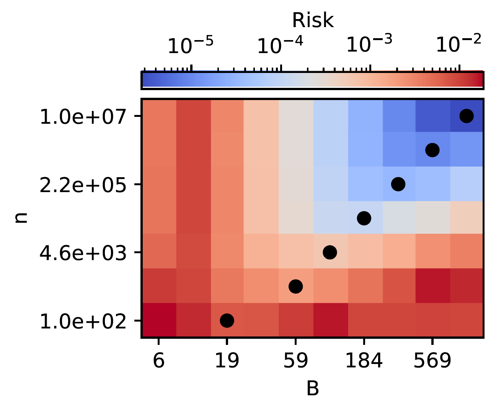
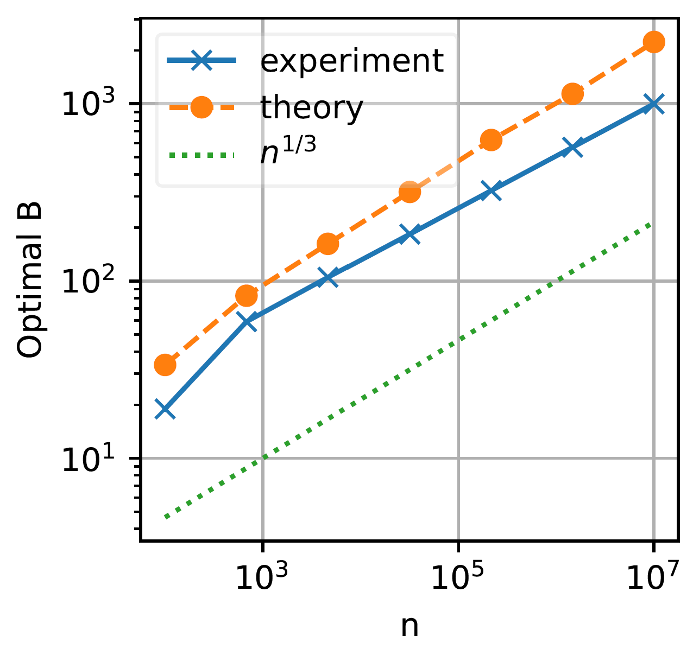
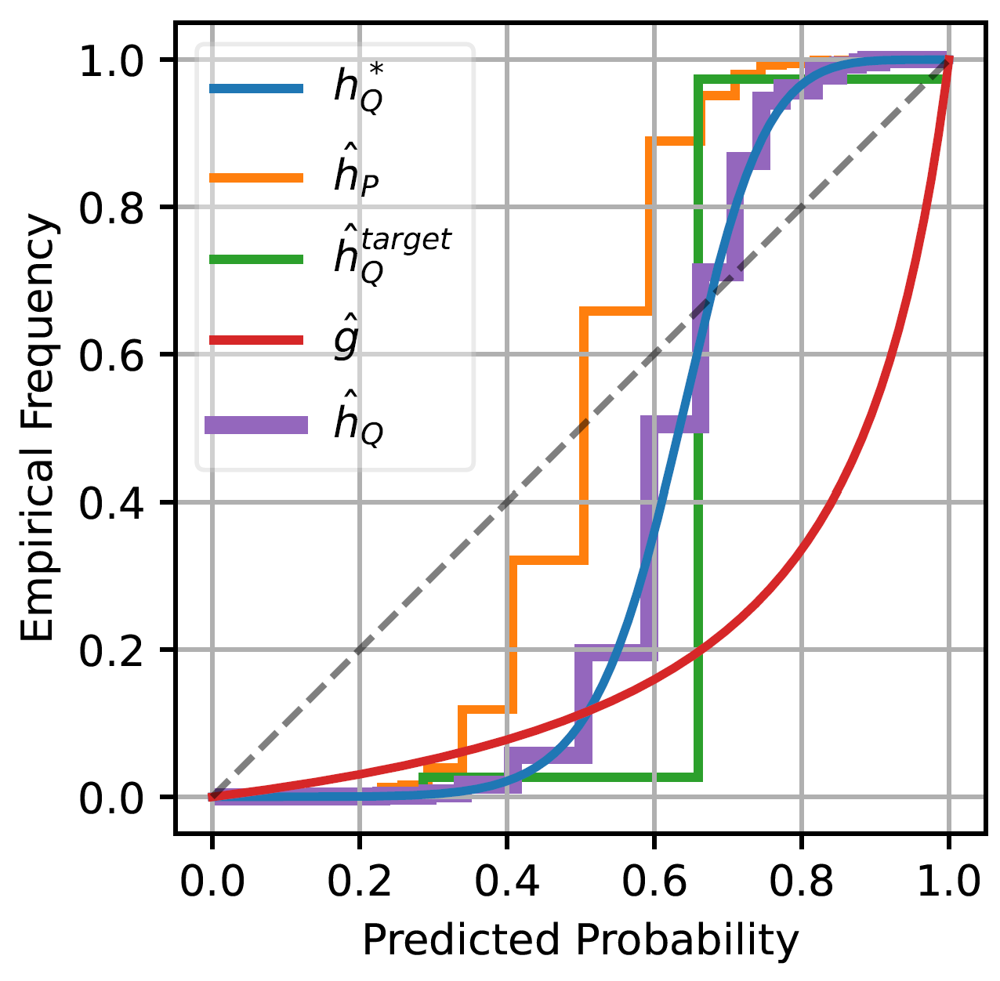

# Minimum-Risk Recalibration of Classifiers
This repository is the official implementation of [Minimum-Risk Recalibration of Classifiers](https://arxiv.org/abs/2305.10886).

## Results

### Calibration with Uniform-Mass Binning
* Left: The recalibration risk for different configurations of sample size $n$ and number of bins $B$.
* Right: The optimal bin number scales on the order of $O(n^{1/3})$.




### Calibration under Label Shift

Calibration curves and metrics for 4 methods: `Source` $\hat{h}_P$, `Target` $\hat{h}^{target}_Q$, `Label Shift` $\hat{g}$, and `Composite` $\hat{h}_Q$.



| Method      | $R^{cal}$         | $R^{sha}$       | $R$             | MSE             |
|:------------|:------------------|:----------------|:----------------|:----------------|
| source      | 0.014+/-0.007     | 0.0024+/-0.0007 | 0.017+/-0.007   | 0.018+/-0.007   |
| target      | 0.0008+/-0.0013   | 0.0541+/-0.0033 | 0.055+/-0.005   | 0.056+/-0.005   |
| label shift | 0.028+/-0.005     | 0               | 0.028+/-0.005   | 0.029+/-0.005   |
| composite   | 0.00018+/-0.00029 | 0.0024+/-0.0007 | 0.0026+/-0.0006 | 0.0039+/-0.0006 |

## Code
* Jupyter notebooks: `Calibration.ipynb` and `Label Shift.ipynb`
* `calibration.py` contains implementations of different calibrators.

## Cite
```plain
@article{sun2023minimum,
  title={Minimum-Risk Recalibration of Classifiers},
  author={Sun, Zeyu and Song, Dogyoon and Hero, Alfred},
  journal={arXiv preprint arXiv:2305.10886},
  year={2023}
}
```